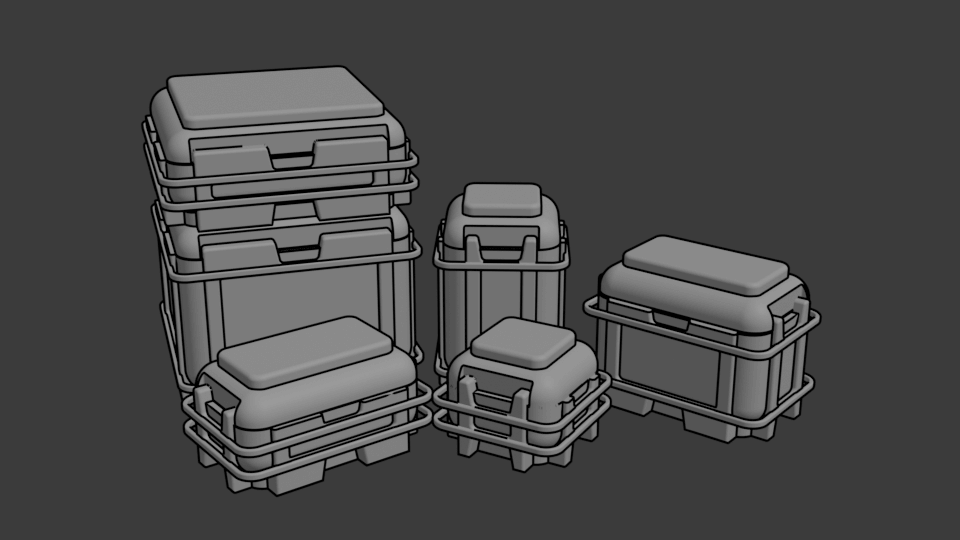

# Parametric 3d printable scifi boxes

This repo contains a python file which can be used to generate 3d printable scifi containers suitable for use in all sorts of playsets and dioramas. The generation is tuned to produce boxes that will work well with 1:18 scale (3.75-4") figures, but feel free to experiment.

There are a number of parameters at the top of the file. I recommend changing just the widht/height/depth parameters, but again, feel free to play around. The only thing that might happen is that the model may fail to generate for particular combinations of inputs.

Enjoy!

## Prerequisites

The tool relies on , so you'll need to have that set up first.

Once you have that, you should be able to run the script and generate boxes. I definitely recommend installing the cq-editor in order to get a nice visual UI to work with.

